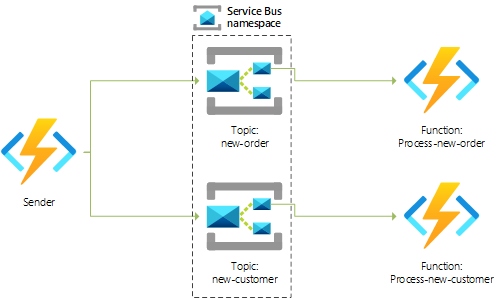
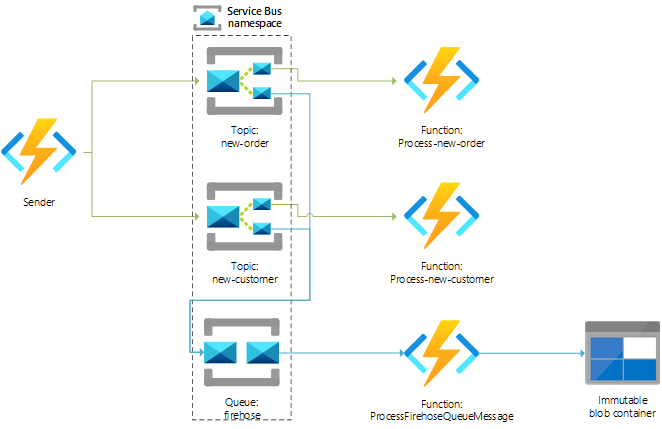
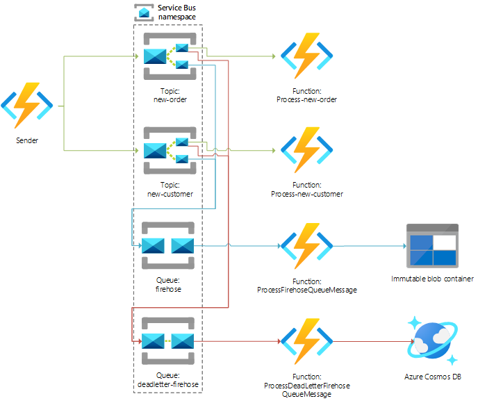

# Service Bus and serverless sample

This sample illustrates one approach to work with a Service Bus-based messaging system using Azure Functions.

Requirements:
* Use serverless technologies.
* Store a copy of all messages into an immutable storage account.
* Route all unprocessable (dead-lettered) messages to a single queue, and lg them to a Cosmos DB database for later analysis.

## Processing

## Firehose logging

## Dead-letter processing

